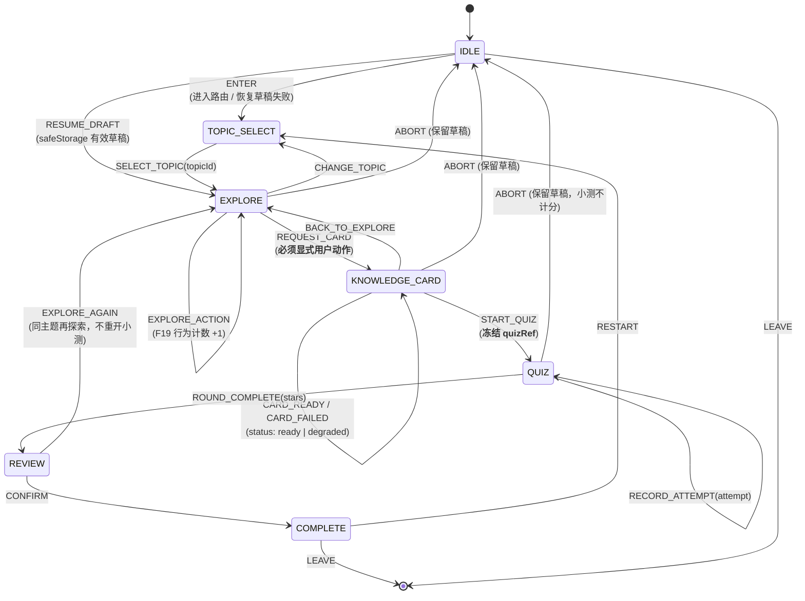

# 研究游戏模式 · 主架构文档（CMML）

> 版本：v1.0（Phase 3 技术搭建）
> 作者：程基岩（工程专业主程）
> 产品方向：**CMML — 好奇心驱动的多模态精熟闭环**
> 上游依据：`docs/研究游戏模式-功能可行性清单.md`（F1–F19 / C1–C7 / R1–R9）
> 适用范围：本文档是研究模式落地的**单一架构真相源**。与既有代码冲突时，以本文档中标注的「实测」结论为准。
>
> **本文档中所有文件路径均已对照仓库实测核验（2026-08-12）**，并在若干处**修正了可行性清单的表述**（见 §7 修正记录）。

---

## 0. 摘要（给主理人的 10 行）

1. 研究模式**不新建引擎**。它是一层**会话编排层（F17 ResearchSession）**，把既有 Explore 组件 / AI 内容端点 / `RoundRunner` / DDA / SRS 串成一条状态机。
2. 编排层采用**显式 FSM**（`IDLE → TOPIC_SELECT → EXPLORE → KNOWLEDGE_CARD → QUIZ → REVIEW → COMPLETE`），而非扩展 `RoundRunner` 的「轮」抽象（理由见 ADR-001）。
3. FSM 拆成**纯 reducer（lib 层）+ React 钩子（store 层）**，复刻既有 `lib/adaptChain.ts`（纯）+ `store/adaptiveDifficulty.ts`（钩子）的分层先例，避免 lib→store 层倒置。
4. **DDA 只在 `RoundRunner.onRoundStart` 落档**，编排层任何其它位置禁止触碰难度（C3 硬约束，见 §2.4 收敛性证明）。
5. 会话内的**易变 FSM 状态不进 `Progress`**，走 `safeStorage` 草稿命名空间；只有跨会话聚合量（笔记 / 收藏 / 行为计数）进 `Progress` 并登记 `createInitialProgress()`（C4，见 ADR-004）。
6. 掌握度**无需新增字段**——`Progress.mastery` 已是通用 `Record<string, MasteryItem>`，研究知识点直接用技能键 `research:<topicId>`。
7. 知识卡采用「**先 `listContent` 复用，无匹配才 `generateContent`**」策略，用免限速的读路径卸载写路径压力（缓解本架构最大风险，见 §4.3）。
8. 徽章**只奖励探索行为**，不读正确率（F19 / ADR-003），并在测试中以断言守门防回归。
9. 路由注册实际是 **4 处文件、7 个改动点**（`nav.ts` 内含 4 个子改动，i18n 需同时补 `categories.research`），且**底部 Tab 已满 6/6**——研究入口不得进 bottom（见 §5）。
10. **架构评审结论：PASS**（原 CONCERNS，3 项阻塞项 B1/B2/B3 已于 2026-08-12 由主理人裁决清零，见 §8.0）。最关键技术风险 **B1 已裁决**：content 独立限速桶，模块故障隔离。

---

## 1. 系统上下文与分层

### 1.1 在现有架构中的位置

「宝贝学习乐园」当前形态（实测）：

- 前端：React 18 + Vite + TypeScript SPA，**自研 hash 路由**（`src/lib/router.ts`，非 react-router）
- BFF：单一 Cloudflare Worker `baobei-bff`（`worker/index.mjs`），挂 `CONTENT_KV`
- 离线：手写 Service Worker（`public/sw.js`）+ 构建期生成的预缓存清单（`scripts/gen-sw-precache.mjs` → `public/precache-manifest.json`）

研究模式**不改动上述任何基础设施**，只在 SPA 内新增一个模块与一层编排。

### 1.2 分层边界图

```
┌──────────────────────────────────────────────────────────────────────────┐
│ L5  UI 层（新建，全部走 t() 文案 · C7）                                  │
│                                                                          │
│   src/modules/research/ResearchModePage.tsx      ← 路由页（唯一入口）     │
│   src/modules/research/TopicGrid.tsx             ← 选题网格（仿 ExploreMore）│
│   src/modules/research/ResearchCanvas.tsx        ← 探索画布（媒体槽宿主）  │
│   src/modules/research/KnowledgeCardPanel.tsx    ← AI 知识卡 + 渐进揭示    │
│   src/modules/research/DiscoveryGallery.tsx      ← 发现画廊（仿 ContentStation）│
│   src/modules/research/components/ExploreSlot.tsx← 媒体槽适配器（lazy 注册表）│
└───────────────────────────────┬──────────────────────────────────────────┘
                                │ 只读 FSM 快照 + 派发事件，UI 不持有会话状态
┌───────────────────────────────▼──────────────────────────────────────────┐
│ L4  会话编排层（**新建 · F17 · 本次唯一新积木**）                          │
│                                                                          │
│   src/lib/research/sessionMachine.ts   ← **纯 reducer**，零 React / 零 store│
│   src/lib/research/researchTopics.ts   ← 静态选题注册表（数据，C2）        │
│   src/lib/research/researchDraft.ts    ← safeStorage 草稿读写（C7）        │
│   src/store/researchSession.ts         ← **React 钩子**，订阅 store        │
│                                                                          │
│   职责：阶段流转 / 阶段间数据契约 / 落库时机 / AI 失败降级回退路径          │
│   禁止：改造任何 L3/L2/L1 组件（out-of-scope，F17 明文）                   │
└───────────────────────────────┬──────────────────────────────────────────┘
                                │ props 下行，回调上行（组件零改动）
┌───────────────────────────────▼──────────────────────────────────────────┐
│ L3  玩法层（**100% 复用，零改动**）                                       │
│   src/components/RoundRunner.tsx   ← 一轮 N 题；onRoundStart 落档点        │
│   src/components/QuizCard.tsx      ← 单题 play→answer→feedback→next        │
└───────────────────────────────┬──────────────────────────────────────────┘
                                │
┌───────────────────────────────▼──────────────────────────────────────────┐
│ L2  领域层（**复用，仅 Progress 增 3 字段 + badges 增规则**）              │
│   src/lib/adaptChain.ts              ← DDA：recordAttempt/recommendDifficulty│
│   src/store/adaptiveDifficulty.ts    ← useAdaptiveDifficultyState（锁存）  │
│   src/lib/srs.ts                     ← review() 难度感知升降              │
│   src/store/useStore.ts#practice()   ← **进度唯一入口**                   │
│   src/types.ts#Progress              ← 增 3 字段（C4）                    │
│   src/lib/progress.ts#createInitialProgress() ← 同步登记（C4 硬门槛）      │
│   src/data/badges.ts                 ← 增 research-* 行为型徽章（F19）     │
└───────────────────────────────┬──────────────────────────────────────────┘
                                │
┌───────────────────────────────▼──────────────────────────────────────────┐
│ L1  内容层（**复用，MVP 不改 Worker**）                                   │
│   src/lib/ai/contentClient.ts   ← generateContent(10s 冷却) / listContent │
│   src/lib/ai/useAi.ts           ← useAiStream / useAiTask（静默降级）      │
│   worker/index.mjs              ← /api/content/{generate,list} + CONTENT_KV│
│                                   CHILD_SAFETY_PROMPT + 注入拦截 + PII 脱敏 │
└───────────────────────────────┬──────────────────────────────────────────┘
                                │
┌───────────────────────────────▼──────────────────────────────────────────┐
│ L0  平台规约（强制）                                                      │
│   src/lib/safeStorage.ts  ← 唯一存储入口，禁裸 localStorage（C7）          │
│   src/i18n/*              ← t() 嵌套点键，组件禁硬编码中文（C7）           │
│   src/lib/router.ts       ← ROUTES 枚举（C6）                            │
│   public/sw.js + scripts/gen-sw-precache.mjs ← 预缓存（C5）               │
└──────────────────────────────────────────────────────────────────────────┘
```

### 1.3 依赖方向铁律

- **只允许向下依赖**。L4 编排层可以调 L3/L2/L1；L3/L2/L1 **绝不反向感知** L4 的存在。
- `src/lib/research/*` 属 lib 层，**禁止 import `@/store/*`**。这不是洁癖：仓库已经为此做过一次迁移——`adaptChain` 的 React 钩子被从 lib 移到 `store/adaptiveDifficulty.ts`，**明确目的是「消除 lib→store 的层倒置循环依赖：纯逻辑留在 lib，需要订阅 store 的钩子放在本层」**（原文见 `src/store/adaptiveDifficulty.ts:1-7` 头注释）。研究模块必须遵循同一先例，否则会重新引入循环依赖。
- 因此 FSM 拆两半：
  - `lib/research/sessionMachine.ts` = 纯 `reducer(state, event) => state`，可脱离 React 单测（**这是 FSM 可测性的全部来源**）
  - `store/researchSession.ts` = `useResearchSession()`，负责接 `useStore` / `useAdaptiveDifficultyState` / `safeStorage` 副作用

---

## 2. ResearchSession 状态机（F17）

### 2.1 状态图



### 2.2 逐状态契约表

| 状态 | 入口条件 / 入口动作 | 出口条件 | 复用资产 | 数据留存点 |
|---|---|---|---|---|
| `IDLE` | 进入 `#/research` 路由；尝试 `researchDraft.load()` | `ENTER` 或 `RESUME_DRAFT` | — | 只读草稿，不写 |
| `TOPIC_SELECT` | 渲染选题网格，读 `researchTopics.ts` | 用户选主题 → `SELECT_TOPIC` | `TopicGrid`（仿 `src/components/home/ExploreMore.tsx`） | **无**（选题前不落任何库） |
| `EXPLORE` | 挂载 `ExploreSlot`，`revealLevel=1`，起计时 | 用户点「我想知道更多」→ `REQUEST_CARD` | `ColorExplore` / `VehicleExplore` / `JobExplore` / `DinoWorld` / `SpaceExplorer` / `BodyAdventure` | ① 草稿 → `safeStorage`（防刷新丢失）② `exploreActions`/`exploreMs` 累计（F19 行为源） |
| `KNOWLEDGE_CARD` | 触发知识卡获取（§4.3 策略）；`status='loading'` | `START_QUIZ`（**ready 或 degraded 都允许**） | `contentClient.listContent` / `generateContent`；`speak()` 朗读（F11） | ① 卡片 `kvId` 写草稿 ② 用户「收藏」→ `Progress.discoveries`（`practice` 之外的独立 action） |
| `QUIZ` | **冻结 `quizRef`**（skillKey / questionsPerRound / frozenDifficulty），挂载 `RoundRunner` | `ROUND_COMPLETE(stars)` | `RoundRunner` + `QuizCard`（零改动） | ① 每题 `recordAttempt('research', …)`（DDA）② 每题 `practice('research:<topicId>', correct, star, diff)`（SRS + 成长快照） |
| `REVIEW` | 展示本轮小结 + 掌握度变化 + 待复习提示 | `CONFIRM` → `COMPLETE`；或 `EXPLORE_AGAIN` | `srs.ts#dueText` / `masteryRate` / `subjectLabel` | `srsRef` 更新（**仅引用，掌握度真相源恒为 `progress.mastery`**） |
| `COMPLETE` | 结算：`researchStats.sessionsCompleted+1`，跑 `findNewBadges(p)` | `RESTART` / `LEAVE` | `src/data/badges.ts`（F19 行为型规则） | ① `researchStats` 落 `Progress` ② `researchDraft.clear()` 清草稿 |

### 2.3 降级与错误回退路径（G1 设计缺口的正面回答）

编排层必须把「AI 不可用」当作**一等公民路径**，而非异常分支：

| 失败场景 | 检测点 | 回退行为 | 用户可感知结果 |
|---|---|---|---|
| 10s 客户端冷却未过 | `generateContent` 返回 `{ok:false, cooldown:N}` | 停在 `KNOWLEDGE_CARD`，`status='idle'`，显示「再等 N 秒」倒计时；**不消耗服务端配额** | 按钮短暂禁用 |
| 服务端 429 `rate_limited` | `generateContent` 返回 `error='生成太频繁啦…'` | `status='degraded'`；**允许直接 `START_QUIZ`** | 「小智有点忙，我们先来玩小测验」 |
| Worker 502 / `parse_failed` / 网络断 | 同上 error 分支 | `status='degraded'`，回退到主题**静态兜底文案**（`researchTopics.ts` 内置 `fallbackFactsI18nKey`） | 看到静态知识点，闭环不断 |
| KV 不可用 | Worker 静默不持久，仍返回 item | 卡片可读但 `kvId` 不可回捞 → 不允许「收藏」 | 收藏按钮隐藏 |
| 离线（PWA） | `fetch` 抛错 | `status='degraded'` + 读 `safeStorage` 已缓存卡片 | 可看历史卡片，不可生成 |

**铁律**：`QUIZ` 段**永不依赖 AI**。题目来自静态 / 程序化题库（C2），所以即使 AI 全线不可用，CMML 的「提取测验 → SRS 巩固」这条最硬证据链（原则 1+2）依然完整。这是整个降级设计的核心价值。

### 2.4 DDA 接入与「严禁回合内重评」的收敛性证明（C3）

**接线方式（唯一合法写法）：**

```ts
// store/researchSession.ts 内
const [diff, setDiff, meta] = useAdaptiveDifficultyState('research');

// ResearchModePage 渲染 QUIZ 段
<RoundRunner
  difficulty={diff}                       // 锁存值，回合内恒定
  questionsPerRound={session.quizRef.questionsPerRound}   // 冻结值，禁止回合内变化
  makeQuestion={makeResearchQuestion}     // 内部走 makeRef，身份变化安全
  onRoundStart={() => meta.syncNow()}     // ★ 全项目唯一合法的落档点
  onAnswered={(q, correct, d) => {
    recordAttempt('research', { correct, ms, hintUsed, errorType: q.kind });
    practice(`research:${topicId}`, correct, 1, d);
  }}
  onComplete={(stars) => dispatch({ type: 'ROUND_COMPLETE', stars })}
/>
```

**为什么不会死循环**（这点不直观，实现者极易写出震荡代码，故在此证明）：

1. `onRoundStart` 调 `meta.syncNow()` → `setLatched(recommendedRef.current)`
2. 若 `latched` 确实变了 → `diff` 变 → 命中 `RoundRunner` 的 `useEffect([difficulty])` → 再跑一次 `start()` → 再触发 `onRoundStart` → 再 `syncNow()`
3. 第二次 `syncNow()` 时 `latched === recommended` 已成立 → `setLatched` 传入同值 → React 不再重渲染 → **收敛**

即最多迭代 2 次即稳定（`src/components/RoundRunner.tsx:108-121` 与 `src/store/adaptiveDifficulty.ts:68-70` 的注释已隐含此设计）。

**编排层的 3 条禁令：**

- ❌ 禁止在 `QUIZ` 状态期间调用 `meta.syncNow()` / `meta.reset()` / `setDiff()`（`onRoundStart` 内部除外）
- ❌ 禁止给 `RoundRunner` 加会在回合内变化的 `key`（如 `key={session.status}`、`key={revealLevel}`）——会整轮重挂，孩子被打回第 1 题
- ❌ 禁止把 `difficulty` 写进 FSM state 后在 reducer 里重算；`frozenDifficulty` 只在 `START_QUIZ` 事件时**快照一次**，仅供小结展示与 `practice()` 透传核对

> 说明：`RoundRunner` 内部的 `calibrateDifficulty(difficulty, correctStreak, wrongStreak)` 是**会话内微校准**，作用于「本题实际出题难度」，不改 `difficulty` prop、不触发重挂。它与 C3 不冲突，且已由 `src/lib/difficulty.test.ts` 覆盖。

---

## 3. 会话数据契约（TypeScript 接口草案）

放置位置：`src/lib/research/types.ts`（纯类型，lib 层，零依赖 store）。

```ts
import type { Tone } from '@/lib/tones';
import type { AiContentType } from '@/lib/ai/contentClient';

/** FSM 状态（与 §2.1 状态图一一对应） */
export type ResearchStatus =
  | 'IDLE'
  | 'TOPIC_SELECT'
  | 'EXPLORE'
  | 'KNOWLEDGE_CARD'
  | 'QUIZ'
  | 'REVIEW'
  | 'COMPLETE';

/** 媒体槽标识 —— 指向既有 Explore 组件的注册表键，而非组件引用本身
 *  （保持 researchTopics.ts 为纯数据，组件在 ExploreSlot.tsx 里 lazy 注册） */
export type ExploreSlotKey =
  | 'color'    // src/components/ColorExplore.tsx
  | 'vehicle'  // src/components/VehicleExplore.tsx
  | 'job'      // src/components/JobExplore.tsx
  | 'dino'     // src/modules/science/components/DinoWorld.tsx
  | 'space'    // src/modules/science/components/SpaceExplorer.tsx
  | 'body';    // src/modules/science/components/BodyAdventure.tsx

/** 静态选题注册项（F2）—— 数据驱动，禁内联中文（C7） */
export interface ResearchTopic {
  id: string;                     // 'color' | 'dino' | 'space' …（与 skill 键拼接）
  /** i18n 点键前缀，取 `${i18nKey}.label` / `.desc`；**禁止直接写中文** */
  i18nKey: string;                // 如 'research.topic.color'
  emoji: string;
  tone: Tone;
  exploreSlot: ExploreSlotKey;
  /** 知识卡走哪个既有 AI 类型（C2：MVP 复用 science/story/riddle，不新增端点） */
  aiContentType: AiContentType;
  /** KV 复用匹配用的关键词（§4.3 list-first 策略） */
  cardMatchTags: string[];
  /** AI 全线不可用时的静态兜底知识点 i18n 键（§2.3 降级） */
  fallbackFactsI18nKey: string;
  /** SRS 技能键前缀，最终为 `research:<id>`（复用 srs.SKILL 命名风格） */
  quizSkillKey: string;
  /** F18 认知负荷阈值：按 ageRange 取；core=首屏事实条数，extended=每次揭示增量 */
  density: Record<string, { core: number; extended: number; maxReveal: number }>;
}

/** AI 知识卡（精细加工段） */
export interface KnowledgeCard {
  /** KV 主键（Worker 侧实际键为 `item:${id}`，id 形如 `science:1699…:ab12`）
   *  null = 未生成 / 降级 / KV 不可用（此时不允许收藏） */
  kvId: string | null;
  title: string;
  /** 与 AiContentItem.content 同形：story 为段落文本，riddle/science 为条目数组 */
  body: string | string[];
  /** 来源：ai=新生成，kv=复用已有，fallback=静态兜底 */
  source: 'ai' | 'kv' | 'fallback';
  /** F18 渐进揭示：已揭示到第几层（1 = 仅核心层） */
  revealed: number;
  status: 'idle' | 'loading' | 'ready' | 'degraded';
  createdAt: number;
}

/** 单次作答留痕（与 adaptChain.AttemptInput 字段对齐，便于直接转发） */
export interface ResearchAttempt {
  correct: boolean;
  ms: number;
  hintUsed: boolean;
  errorType?: string;
  /** 本题实际出题难度（RoundRunner.onAnswered 第 3 参，经 calibrateDifficulty 后） */
  difficulty: 1 | 2 | 3;
  t: number;
}

/** 小测段冻结引用 —— 一旦进入 QUIZ 即不可变（C3） */
export interface QuizRef {
  /** 完整 SRS 技能键，如 'research:dino' */
  skillKey: string;
  /** CMML 规定 3–5 题的轻量收尾（缓解 R6：测验不得抢占探索主体） */
  questionsPerRound: 3 | 4 | 5;
  /** START_QUIZ 时对 DDA 锁存值的快照，仅供展示与核对，**不作为出题源** */
  frozenDifficulty: 1 | 2 | 3;
}

/** 会话主体 —— **易变态，存 safeStorage 草稿，不进 Progress**（ADR-004） */
export interface ResearchSession {
  sessionId: string;
  /** 草稿结构版本，bump 后旧草稿直接丢弃（复刻 adaptChain 的 CHAIN_VERSION 手法） */
  version: number;
  status: ResearchStatus;
  topicId: string | null;
  /** 驱动 F18 密度阈值与 AI ageRange 入参 */
  ageRange: string;

  /* —— 探索段（F18/F19 数据源）—— */
  exploreRevealLevel: number;
  exploreActions: number;
  exploreMs: number;

  /* —— 知识卡段 —— */
  knowledgeCard: KnowledgeCard | null;

  /* —— 小测段 —— */
  quizRef: QuizRef | null;
  attempts: ResearchAttempt[];

  /* —— 巩固段：仅存引用，掌握度真相源恒为 progress.mastery —— */
  srsRef: { skill: string; lastReviewedAt: number } | null;

  /** 本会话内收藏的知识卡 kvId（结算时并入 Progress.discoveries） */
  sessionDiscoveries: string[];

  createdAt: number;
  updatedAt: number;
}

/** FSM 事件（reducer 的全部合法输入） */
export type ResearchEvent =
  | { type: 'ENTER'; ageRange: string }
  | { type: 'RESUME_DRAFT'; draft: ResearchSession }
  | { type: 'SELECT_TOPIC'; topicId: string }
  | { type: 'CHANGE_TOPIC' }
  | { type: 'EXPLORE_ACTION'; deltaMs?: number }
  | { type: 'REVEAL_MORE' }
  | { type: 'REQUEST_CARD' }
  | { type: 'CARD_READY'; card: KnowledgeCard }
  | { type: 'CARD_FAILED'; reason: 'cooldown' | 'rate_limited' | 'upstream' | 'offline' }
  | { type: 'FAVORITE_CARD'; kvId: string }
  | { type: 'BACK_TO_EXPLORE' }
  | { type: 'START_QUIZ'; quizRef: QuizRef }
  | { type: 'RECORD_ATTEMPT'; attempt: ResearchAttempt }
  | { type: 'ROUND_COMPLETE'; stars: number }
  | { type: 'CONFIRM' }
  | { type: 'EXPLORE_AGAIN' }
  | { type: 'RESTART' }
  | { type: 'ABORT' };
```

### 3.1 字段落地位置裁决表（C4 关键）

| 数据 | 存哪 | 是否需登记 `createInitialProgress()` | 理由 |
|---|---|---|---|
| `ResearchSession` 全体（FSM 易变态） | `safeStorage` key `research-session-draft` | **否** | 秒级易变；进 Progress 会拖累每次 persist 写入 + 多档案 merge 冲突（ADR-004） |
| 研究掌握度 | `Progress.mastery['research:<topicId>']` | **否（已存在）** | `mastery` 已是通用 `Record<string, MasteryItem>`，**零新增字段**——这是本设计最省的一处 |
| 研究笔记（F6） | `Progress.researchNotes: Record<string,string>` | ✅ **是** → `researchNotes: {}` | 照搬既有 `poemNotes` 模式（`src/types.ts:230`） |
| 收藏的知识卡（F5） | `Progress.discoveries: string[]` | ✅ **是** → `discoveries: []` | 跨会话资产，家长可见物 |
| 探索行为计数（F19） | `Progress.researchStats: ResearchStats` | ✅ **是** → 见下方默认值 | 徽章唯一数据源，必须持久 |
| 成长快照 | `Progress.growth` | **否（已存在）** | `practice()` 内部经 `_withDailySnapshot` 自动写入 |
| 星星 / 每日日志 | `Progress.stars` / `dailyLog` | **否（已存在）** | 同上，`practice()` 全包 |

```ts
/** 追加到 src/types.ts */
export interface ResearchStats {
  /** 探索过的主题 id（去重）→ 徽章「博物学者」 */
  topicsExplored: string[];
  /** 累计探索交互次数 → 徽章「小小探险家」（F19 行为奖励核心计数） */
  exploreActions: number;
  /** 读过的知识卡数（含降级兜底卡） */
  cardsRead: number;
  /** 完成的研究会话数（走到 COMPLETE） */
  sessionsCompleted: number;
  /** 累计探索时长（秒），家长中心用 */
  exploreSeconds: number;
}

/** 追加到 src/lib/progress.ts#createInitialProgress() 返回对象 —— C4 硬门槛 */
researchNotes: {},
discoveries: [],
researchStats: {
  topicsExplored: [],
  exploreActions: 0,
  cardsRead: 0,
  sessionsCompleted: 0,
  exploreSeconds: 0,
},
```

> ⚠️ **C4 遗漏的真实后果**：老用户升级时 zustand persist 的 merge 不会凭空造出新字段 → `progress.researchStats.exploreActions` 抛 `TypeError: Cannot read properties of undefined`，且**崩在 `findNewBadges(p)` 里**（徽章遍历全站执行），会连带炸掉首页与成长博物馆，而不只是研究页。这是最高优先级的守门项。

---

## 4. 与既有资产的接线（逐条）

### 4.1 RoundRunner（小测段）— 零改动复用

- 挂载时机：仅 `status === 'QUIZ'`；`START_QUIZ` 前不得预挂载（否则 `useState` 初始化就会调 `makeQuestion` 出题，浪费且污染去重池）
- `makeQuestion(difficulty)`：闭包从 `researchTopics` 的静态题池取题；可叠加 `src/lib/drill.ts#makeSpacedDrill` 的复习题（既有 ~35% 混入逻辑）实现 CMML 的「间隔巩固」
- `questionsPerRound`：3–5，取自 `quizRef`，**回合内冻结**
- `onSolved` 不用（发星统一走 `practice()` 的 `star` 参，避免双发）
- `renderSummary`：注入研究专属结算（「你发现了 N 条知识」+ 继续探索按钮），仿 `AdventurePage` 的用法
- `aiExplain`：透传给 `QuizCard`，走既有 AI 讲题链（C1 自动继承安全护栏）

> `QuizCard` 的既有行为会**自动**为研究模式带来两项 CMML 收益，无需额外代码：答错显示 `hint`（脚手架）、连对 3 题触发 AI 知识扩展（好奇心回流）。

### 4.2 useAdaptiveDifficultyState（难度锁存）

- 学科键统一用 `'research'`（**不按主题分档**）。理由：`adaptChain` 的心流区判定需要 ≥3 条滚动样本（`applyRecentSignals` 内 `log.length < 3` 直接返回基线），若按 `research:dino` 细分，每个主题样本量太小，DDA 长期退化为「恒定基线」而失效。全局 `'research'` 档位 + 按主题记 SRS，是样本量与个性化的正确折中。
- 落档点唯一：`onRoundStart` → `meta.syncNow()`（§2.4）
- `meta.pending` 用于在 `REVIEW` 段友好提示「小智想给你换个难度」，由孩子在下一轮开始时自然生效——**不在 REVIEW 直接 syncNow**

### 4.3 generateContent / listContent（知识卡）— 关键策略

MVP **不新增 Worker 端点**（F4 专属 `explainer` 类型推迟到 P1），复用既有 `science` / `story` / `riddle`。获取顺序：

```
REQUEST_CARD
   │
   ├─① 会话草稿内已有 ready 卡片？ ──────────────→ 直接用（零网络）
   │
   ├─② safeStorage 本地卡片缓存命中 cardMatchTags？ → 用（离线可用，C5 协同）
   │
   ├─③ listContent(topic.aiContentType, 8)         → **免限速读路径**
   │     按 cardMatchTags 匹配 title/tags 命中？ ──→ 用（source='kv'）
   │
   ├─④ generateContent(type, ageRange)            → **受限写路径**
   │     ok → source='ai'，写本地缓存
   │     429/cooldown/502 → CARD_FAILED
   │
   └─⑤ CARD_FAILED → 静态 fallbackFactsI18nKey（source='fallback'，status='degraded'）
                      **仍允许 START_QUIZ，闭环不断**
```

**为什么这个顺序是架构级决策而非优化**：`/api/content/list` 无限速（`worker/index.mjs:167` 起，无 `rateLimited` 调用），而 `/api/content/generate` 与小智 chat 原共用同一 `'ai'` 限速桶 30/min（`worker/index.mjs:87` 与 `:375`）。经主理人裁决 B1，`generateContent` 已改用独立 `bucket='content'`，模块故障隔离；把读路径放在写路径之前，仍是进一步降频的主要手段（§8 阻塞项 1 已清零）。

**已知限制（诚实标注）**：KV 无主题索引，`list` 只能按 `type` 前缀扫描（`item:${type}:`），主题匹配只能靠客户端 `tags`/`title` 关键词模糊比对，**命中率不可保证**，且可能拿到与当前主题弱相关的卡片。这正是 F4 专属 `explainer` 端点（KV 前缀 `item:explainer:<topicId>:`）存在的理由。MVP 需接受「卡片可能偏泛化」，或由主理人裁决是否把 F4 提前到 MVP（见 §8 阻塞项 3）。

**安全（C1，强制且自动继承）**：所有生成经 Worker 的 `CHILD_SAFETY_PROMPT` + `INJECTION_PATTERNS` + `CONTENT_BLOCKLIST` + `redactPII`；模型受 `ALLOWED_MODELS` 约束。编排层**不得**新开任何绕过 `worker/index.mjs` 的 AI 通道。

### 4.4 practice()（落库）— 进度唯一入口

```ts
// 每题答完，在 RoundRunner.onAnswered 内
practice(`research:${topicId}`, correct, 1, effectiveDifficulty);
```

- 技能键 `research:<topicId>` 会被 `srs.ts#skillCategory` 解析出 `key='research'`，而 `CATEGORY`/`SUBJECTS` 里**没有 `research` 条目** → `subjectLabel()` 回落「其他」、`subjectEmoji()` 回落 📘。这不会报错，但家长中心会显示「其他」。**建议在 `srs.ts` 的 `SUBJECTS` 追加一条 `{ key:'research', label:'研究', emoji:'🔬', tone:'green', color:'#0ea5e9' }`**——一行数据，收益是家长报表正确归类。（记为控制清单项，非阻塞）
- `practice()` 内部已串好 SRS `review()`（含难度感知升降）、错题本、成长快照，编排层**不得**再直接调 `srs.review()` 或手写 mastery，否则绕过唯一入口
- 「发现确认」不走 `practice()`（那会污染掌握度），走独立的 `researchStats` action

### 4.5 Explore 组件（媒体槽）

现状实测：6 个 Explore 组件**不共享统一接口**（分散在 `src/components/` 与 `src/modules/science/components/`），props 形态各异。

因此**不做侵入式抽象**（F17 明文 out-of-scope），改为**适配器 + lazy 注册表**：

```ts
// src/modules/research/components/ExploreSlot.tsx
const SLOT_REGISTRY: Record<ExploreSlotKey, React.LazyExoticComponent<any>> = {
  color:   lazy(() => import('@/components/ColorExplore')),
  vehicle: lazy(() => import('@/components/VehicleExplore')),
  job:     lazy(() => import('@/components/JobExplore')),
  dino:    lazy(() => import('@/modules/science/components/DinoWorld')),
  space:   lazy(() => import('@/modules/science/components/SpaceExplorer')),
  body:    lazy(() => import('@/modules/science/components/BodyAdventure')),
};
```

- 编排层只认 `ExploreSlotKey`，**不感知**各组件 props 差异；适配器负责喂默认 props 并用 `<Suspense>` 兜底
- 探索行为采集（F19）不改这些组件：在**包装容器**上做事件委托（`onClickCapture` 计数）+ 停留计时。这是「零改动复用」与「行为计数」唯一能同时成立的方案
- F18 渐进揭示同样在包装壳层实现（核心层/扩展层由壳层控制显隐），不动组件内部

### 4.6 safeStorage（草稿持久化）

```ts
// src/lib/research/researchDraft.ts
const DRAFT_KEY = 'research-session-draft';
const DRAFT_VERSION = 1;   // 结构变更即 bump，旧草稿丢弃（照搬 adaptChain 的 CHAIN_VERSION 手法）
const DRAFT_TTL_MS = 24 * 3600_000;  // 超期草稿不恢复，避免「昨天的会话」突然弹出

export function loadDraft(): ResearchSession | null;  // 版本/TTL 校验失败返回 null
export function saveDraft(s: ResearchSession): void;  // 走 safeSetJSON
export function clearDraft(): void;
```

- 强制 `safeGetJSON` / `safeSetJSON`（C7），**绝不**碰 `window.localStorage`
- 写入节流：`EXPLORE_ACTION` 高频事件不得每次写盘，按 ≥2s 或状态跃迁时落盘
- `QUIZ` 段**不写草稿快照的 attempts 明细**（DDA 已在 `adapt-chain` 键里存滚动窗口，重复存储是双真相源）

---

## 5. 路由注册计划（C6）

新增路由 `'research'`。**4 处文件，实际 7 个改动点**：

| # | 文件 | 改动点 | 精确内容 | typecheck 能否守门 |
|---|---|---|---|---|
| 1 | `src/lib/router.ts` | `ROUTES` 元组（第 9–44 行） | 追加 `'research'`；`RouteId` 自动派生 | — |
| 2 | `src/App.tsx` | 顶部 `lazy` 区 + `Page()` 的 `switch` | `const ResearchModePage = lazy(() => import('@/modules/research/ResearchModePage'));`<br/>`case 'research': return <ResearchModePage />;` | ⚠️ 部分（switch 有 default 兜底，漏加不报错→静默回落 home） |
| 3a | `src/data/nav.ts` | `NAV_ITEMS` 数组 | `{ id:'research', label:'研究乐园', short:'研究', emoji:'🔬', imageIcon:'/icons/storybook.jpg', tone:'blue', desc:'选题探索 · 记录发现' }`<br/>**注意：不要写 `bottom: true`**（见下方⚠️） | ❌ 否 |
| 3b | `src/data/nav.ts` | `NavCategory` 联合类型（第 68 行） | 追加 `\| 'research'` | ✅ 是 |
| 3c | `src/data/nav.ts` | `NAV_CATEGORY_META`（第 70–78 行） | 追加**第 8 个 chip**：`{ key:'research', emoji:'🔬', tone:'blue' }`（建议插在 `ai` 之后、`growth` 之前） | ❌ 否 |
| 3d | `src/data/nav.ts` | `NAV_CATEGORY_MAP`（第 81–116 行） | `research: 'research',` | ✅ **是**（`Record<RouteId, NavCategory>` 穷尽，漏加即编译失败） |
| 4 | `src/i18n/locales/zh-CN.json`<br/>`src/i18n/locales/en-US.json` | ① `nav.research.label` / `.desc`<br/>② **`categories.research`**（第 112–121 行块内）<br/>③ `research.*` 全部功能文案 | 中英双份 | ❌ 否 |

### 5.1 两个必须提醒的坑

⚠️ **坑 1：底部 Tab 已满**。实测 `bottom: true` 的项恰好 6 个（`home` / `today` / `letters` / `numbers` / `adventure` / `rewards`），而 `NavItem` 注释明确要求「保持 ≤6 个，避免拥挤」。可行性清单 F1 描述的「底部 Tab 出现入口」**与此冲突**。建议：研究入口**不进 bottom**，改由「第 8 个品类 chip」+ 首页 `ExploreMore` 卡片承载。若主理人坚持进 bottom，须同时降级一个现有 tab（属产品决策，见 §8 阻塞项 2）。

⚠️ **坑 2：`categories.research` 极易遗漏**。`NAV_CATEGORY_META` 的标签**不在代码里**，而是走 i18n `categories.*`（实测 `zh-CN.json:112-121` 有 `learn/game/story/create/ai/growth/parent` 七项）。新增第 8 个 chip 却漏补该键，chip 会显示成空白或裸键名，且**不报任何错**。这是 C6 里唯一无类型保护又无运行时报错的改动点 → 必须由测试守门（§9 控制清单 T4）。

### 5.2 选择「新建第 8 品类」而非归入 `'ai'` 的理由

可行性清单原建议归入 `'ai'`（零新增分类代码），本架构**改为新建 `'research'` 品类**，与主理人 Phase 3 指示一致。理由：

- CMML 是**独立产品支柱**（好奇心闭环），不是「AI 工具」。归入 `ai` 会与 `companion`/`content`/`wrongbook` 混为「AI 功能集」，弱化产品定位
- 成本仅多 2 个改动点（3b 的联合类型 + 3c 的 META 项），`navByCategory()` **无需改动**（它按 `NAV_CATEGORY_META` 自动分组过滤，见 `nav.ts:123-134`）
- 参考先例：`growth` 品类正是这样加的（单 route 独占一个品类），有成熟范式可循

---

## 6. 进度字段与徽章

### 6.1 Progress 新增字段（汇总，C4）

见 §3.1 表与代码块。**3 个新字段**（`researchNotes` / `discoveries` / `researchStats`），必须在**两处同步**：

- `src/types.ts#Progress` 接口
- `src/lib/progress.ts#createInitialProgress()` 返回对象

外加确认 `src/store/storeHelpers.ts` 的 merge 路径不会丢弃未知字段（既有 `useStore.test.ts` / `storeHelpers.test.ts` 可扩展断言）。

### 6.2 徽章新增规则（F19：奖励探索行为，不奖励答对）

追加到 `src/data/badges.ts` 的 `BADGES` 数组（`BadgeDef` 契约实测为 `{ id, name, desc, emoji, tone, check(p), meter?(p) }`）：

| id | 名称 | 触发条件（`check`） | `meter` | 行为/结果 |
|---|---|---|---|---|
| `research-first` | 好奇启程 | `p.researchStats.sessionsCompleted >= 1` | `[…, 1]` | 行为（完成闭环，不看对错） |
| `research-explore-20` | 小小探险家 | `p.researchStats.exploreActions >= 20` | `[…, 20]` | **纯行为**（点了多少次） |
| `research-topics-5` | 小博物学者 | `p.researchStats.topicsExplored.length >= 5` | `[…, 5]` | 行为（广度） |
| `research-cards-3` | 知识收藏家 | `p.discoveries.length >= 3` | `[…, 3]` | 行为（收藏） |
| `research-notes-5` | 小小记录员 | `Object.keys(p.researchNotes).length >= 5` | `[…, 5]` | 行为（表达） |

**反向铁律（F19 / ADR-003）**：研究徽章的 `check(p)` / `meter(p)` **禁止**读取 `p.mastery`、`p.stars`、正确率或任何结果量。这条规则必须由测试守门（§9 控制清单 T5），否则未来任何一次「顺手加个研究学霸徽章」都会重新引入过度理由效应（Lepper et al. 1973；Deci et al. 1999）。

**防御性写法**：所有 `check` 必须容忍字段缺失（老档案 merge 后可能为 `undefined`），即写成 `(p.researchStats?.exploreActions ?? 0) >= 20`。C4 登记是第一道防线，这是第二道。

---

## 7. 对可行性清单的修正记录

本架构在实测中发现 3 处需修正的表述，已在上文体现：

| # | 可行性清单原文 | 实测结论 | 影响 |
|---|---|---|---|
| M1 | §4 步骤 3：`NAV_ITEMS` 加 `{ …, category:'ai' }` | `NavItem` 接口（`nav.ts:4-14`）**没有 `category` 字段**；品类归属在独立的 `NAV_CATEGORY_MAP` | 照抄会写出无效属性（TS 报错或静默忽略），品类归属失效 |
| M2 | F1：「首页 / 底部 Tab 出现入口」 | `bottom: true` 已 6/6 满额，注释要求 ≤6 | 需产品拍板，见 §8 阻塞项 2 |
| M3 | C5 表述：「新增静态资源须更新预缓存清单」（易读作全量手维护） | 实测 `scripts/gen-sw-precache.mjs`：`public/fonts/**`（字体扩展名）与 `public/icons/**.png` **自动 walk**；**但 `.jpg` 走手维护常量 `CORE_JPG`（第 32–43 行）** | 精确规则：研究模式若加 png 图标→自动；**若加 jpg 主题封面→必须手改 `CORE_JPG`**，否则离线缺图 |

另确认 1 处**不是**问题：Worker 内容 KV 键为 `item:${id}`，而 `id = ${type}:${ts}:${rand}`，故实际键 `item:science:…` 与 `list` 的 `prefix = item:${type}:` **正确匹配**，无前缀缺陷。

---

## 8. 架构评审

**评审对象**：本文档 §1–§7 的架构设计
**评审人**：程基岩（工程专业主程）
**评审日期**：2026-08-12

### 结论：**PASS**（原 CONCERNS，3 项阻塞项已于 2026-08-12 由主理人裁决并清零）

> 判定依据：架构主体（分层 / FSM / 复用策略 / 数据契约 / C1–C7 守门）**技术上完整且可落地**；3 项阻塞项（B1/B2/B3）均由主理人拍板解决，无遗留技术阻断。详见 §8.0 裁决。

### 8.0 主理人裁决（2026-08-12 · 游承峰）

| 阻塞项 | 裁决 | 落地动作 |
|---|---|---|
| **B1** AI 限速共享桶 | **采纳工程建议 ②：content 独立桶** | `worker/index.mjs` 的 `POST /api/content/generate` 改用 `bucket='content'`（1 行改动，需重新部署 + 回归）。实现成本最低、模块故障隔离最强；原 §4.3 的 list-first 读路径策略仍保留以进一步降频。 |
| **B2** 研究入口导航位置 | **不进底部 Tab（已满 6/6）**，走**第 8 品类 chip `research` + 首页 ExploreMore 卡片** | 维持 §5 原规划（3a 不加 `bottom`；3c 第 8 chip）。与 `growth` 品类先例一致。 |
| **B3** 知识卡-主题关联 | **MVP 接受泛化卡片（复用 science/story + 注入主题上下文）**，F4 专属 `explainer` 端点保留至 P1 | MVP 闭环证据链（好奇心→探索→测验→SRS）不依赖卡片精准度；`generateContent` 调用时透传 `topic.title` + `cardMatchTags` 作 prompt 上下文提升相关性；F4 在 P1 以结构化返回（3 知识点+1 延伸问）落地并享 KV 主题索引。 |

### 8.1 阻塞项（须主理人 / 上游决策后方可进入实现）

**🔴 B1 · AI 限速共享桶会挤兑小智聊天配额（最高风险）**

- 事实：`worker/index.mjs:87`（content/generate）与 `:375`（AI chat）都调用 `rateLimited(request, Number(env.AI_RATE_LIMIT_PER_MIN) || 30)`，**均使用默认 `bucket='ai'`**（`:244` 签名 `rateLimited(request, limit, bucket='ai')`）。两者共享 30 次/分钟。
- 影响：一次研究会话至少 1 次知识卡生成；叠加 `QuizCard` 的「AI 讲题」与「连对 3 题知识扩展」，再叠加多娃家庭同 IP —— 研究模式会**直接吃掉小智伙伴的聊天额度**，表现为「小智突然不说话了」（静默降级），且故障现场在**另一个模块**，极难归因。
- 已做的缓解（§4.3）：list-first 复用 + 显式用户触发 + degraded 一等公民 + 本地缓存。这些能显著降低频次，但**不改变桶共享的本质**。
- 需拍板：① 接受现状 + 仅靠 §4.3 缓解（MVP 最快）；② 在 Worker 给 content 独立桶（如 `bucket='content'`，1 行改动，但属 Worker 变更，需重新部署与回归）；③ 提高 `AI_RATE_LIMIT_PER_MIN`（成本与滥用风险上升）。**工程建议：选 ②**，1 行改动换取模块间故障隔离，性价比最高。

**🔴 B2 · 研究入口的导航位置（底部 Tab 已满 6/6）**

- 需拍板：不进 bottom（工程建议，走第 8 品类 chip + 首页卡片）／降级某个现有 tab 让位。
- 阻塞原因：影响 §5 的 3a 改动内容与首页改动范围。

**🔴 B3 · 知识卡与主题的关联强度（是否把 F4 提前到 MVP）**

- 事实：KV 仅支持 `item:${type}:` 前缀扫描，无主题索引；MVP 复用 `science`/`story` 只能靠客户端关键词模糊匹配，**卡片可能与当前主题弱相关**（如研究「恐龙」拿到「天气」科普）。
- 影响 CMML 第 3 步「AI 知识卡精细加工」的质量，进而影响闭环说服力。
- 需拍板：① 接受 MVP 泛化卡片（可先上线验证闭环，卡片质量作为已知短板）；② 把 F4 专属 `explainer` 端点（`CONTENT_TYPES` 加类型 + `CONTENT_PROMPTS.explainer` 强制 JSON + KV 前缀 `item:explainer:<topicId>:` + `contentClient.AiContentType` 加 `'explainer'` + `ALLOWED_MODELS` 复核）提前进 MVP，成本约 +1 个 Worker 改动周期。

### 8.2 非阻塞关注项（实现期处理即可）

| # | 关注项 | 处置 |
|---|---|---|
| C-1 | `srs.ts` 的 `SUBJECTS`/`CATEGORY` 无 `research` 条目 → 家长中心把研究掌握度显示为「其他」📘 | 追加 1 行 `SUBJECTS` 数据（§4.4） |
| C-2 | `ageRange` 目前在 `contentClient.generateContent` 默认硬编码 `'7-8'`，而 F18 密度阈值需按年龄取 | 会话层显式传 `ageRange`，来源建议取家长设置；MVP 可先固定并标 TODO |
| C-3 | 6 个 Explore 组件 props 形态不一，适配器需逐个试装 | 实现期按主题逐个接入，先接 2 个（`color` + `dino`）验证适配器抽象是否成立，再铺开 |
| C-4 | 探索行为计数用事件委托（`onClickCapture`）可能把无意义点击（如空白区）计入，虚高 F19 计数 | 只在有效交互元素上计数（委托时校验 `closest('[data-explore-action]')`），或由适配器显式上报 |
| C-5 | `QUIZ` 段若 `RoundRunner` 被父组件重挂会打回第 1 题 | 已在 §2.4 列为禁令；由 T2 测试守门 |
| C-6 | 草稿恢复可能让孩子回到「昨天没做完的会话」，体验突兀 | 已设 24h TTL（§4.6）；恢复时须给明确的「继续 / 重新开始」选择 |
| C-7 | **仓库无 git 基线**（实测 `git rev-list --count HEAD` → 无仓库 / 0 commit）。新增 10 个文件 + 修改 10 处**没有任何版本回滚保障**；`docs/REFACTOR_2026-08-11_layer_strict.md` 当时的做法是 `cp -R src /tmp/src_backup` 兜底 | 实现前建议先 `git init` 建立基线（属主理人决策，非本文档范围）；至少沿用 `cp -R src` 快照惯例。**本文档不执行任何 git 操作** |
| C-8 | `tsconfig.app.json` 已开 `noUncheckedIndexedAccess`（该重构把 285 处错误清零）。§3 契约里的 `density: Record<string, {...}>` 与 `SLOT_REGISTRY[key]` 等索引访问**会全部退化为 `T \| undefined`** | 实现时索引访问须显式兜底（`?? DEFAULT_DENSITY`）而非加 `!`；`density` 建议改用**有限联合键**（`Record<AgeRangeKey, …>`）以获得穷尽性检查 |
| C-9 | **`useSettingsStore` 的 persist 缺 `merge`**（实测 `useSettingsStore.ts:123-127` 仅 `name`+`storage`，无 `merge`/`onRehydrateStorage`）。zustand 默认合并为**浅合并** `{ ...currentState, ...persistedState }` → 对 `settings` 对象直接整体替换，老档案里**新增的设置字段会是 `undefined`**。对照 `useStore` 有深度合并 `progress: { ...initialProgress, ...(p?.progress ?? {}) }`（`useStore.ts:1116-1130`），故两 store 的升级安全性不对称。这正是 C4 风险的「另一半」（由可访问性分级文档 §344-346 交叉指出） | **当前研究范围不新增任何 Settings 字段 → 不触发**。但列为守门规则：未来若给研究（或任何功能）加设置项，须同步给 `useSettingsStore` 补 `merge`（或消费侧 `?? default`），否则旧用户该配置为 `undefined`。属非阻塞、前瞻型约束 |

### 8.3 通过项（明确认可，无需再议）

- ✅ 分层与依赖方向（lib 纯 / store 钩子）符合 `src/store/adaptiveDifficulty.ts:1-7` 明示的既定纪律
- ✅ DDA 落档点设计正确，且收敛性已证明（§2.4），C3 满足
- ✅ 掌握度复用 `Progress.mastery` 通用 `Record`，零新增字段，是最优解
- ✅ 会话易变态不进 Progress（ADR-004），避免 persist 写放大与多档案 merge 冲突
- ✅ `QUIZ` 段不依赖 AI，保证 CMML 最硬证据链（提取练习 + SRS）在 AI 全线故障时依然完整
- ✅ Explore 组件零改动（适配器 + lazy 注册表），F17 的 out-of-scope 边界守住

---

## 9. 实现控制清单（Control Manifest）

> 一页规则，程序员可直接执行。**每项完成后须留测试证据路径**。
> 注意：本仓库**无 `tests/` 目录**，测试与源码**同目录并置**（实测 21 个 `src/**/*.test.ts(x)`），新增测试请遵循同一惯例。命令：`npm run test` / `npm run typecheck` / `npm run lint`。

### 9.1 文件改动清单

**新建（10 个）**

| 路径 | 层 | 职责 |
|---|---|---|
| `src/lib/research/types.ts` | lib | §3 全部类型（纯类型，零依赖） |
| `src/lib/research/sessionMachine.ts` | lib | **纯 reducer**，禁 import `@/store/*` |
| `src/lib/research/researchTopics.ts` | lib | 静态选题注册表（数据，禁中文字面量） |
| `src/lib/research/researchDraft.ts` | lib | safeStorage 草稿（版本 + TTL） |
| `src/lib/research/questions.ts` | lib | `makeResearchQuestion(difficulty)` 出题闭包（静态/程序化，C2） |
| `src/store/researchSession.ts` | store | `useResearchSession()` 钩子（接 useStore / DDA / 草稿） |
| `src/modules/research/ResearchModePage.tsx` | UI | 路由页 |
| `src/modules/research/TopicGrid.tsx` | UI | 选题网格 |
| `src/modules/research/ResearchCanvas.tsx` | UI | 探索画布（含 F18 渐进揭示壳层） |
| `src/modules/research/components/ExploreSlot.tsx` | UI | 媒体槽 lazy 注册表 + 适配器 |

（`KnowledgeCardPanel.tsx` / `DiscoveryGallery.tsx` 可按需拆分，属 UI 内部自由度）

**修改（8 处，逐一勾选）**

- [ ] `src/lib/router.ts` — `ROUTES` 追加 `'research'`
- [ ] `src/App.tsx` — `lazy` 导入 + `case 'research'`
- [ ] `src/data/nav.ts` — `NAV_ITEMS` 项（**不加 `bottom`**）
- [ ] `src/data/nav.ts` — `NavCategory` 加 `'research'`
- [ ] `src/data/nav.ts` — `NAV_CATEGORY_META` 加第 8 chip
- [ ] `src/data/nav.ts` — `NAV_CATEGORY_MAP` 加 `research: 'research'`
- [ ] `src/types.ts` — `Progress` 加 3 字段 + `ResearchStats` 接口
- [ ] `src/lib/progress.ts` — `createInitialProgress()` 同步登记 3 字段 ⚠️**C4 硬门槛**
- [ ] `src/data/badges.ts` — 5 条 `research-*` 行为型徽章
- [ ] `src/i18n/locales/zh-CN.json` + `en-US.json` — `nav.research.*` + **`categories.research`** + `research.*`
- [ ] `src/lib/srs.ts` — `SUBJECTS` 追加 `research` 条目（C-1，可选但建议）
- [ ] `scripts/gen-sw-precache.mjs` — **仅当**新增 `.jpg` 资源时改 `CORE_JPG`（C5）
- [ ] `worker/index.mjs` — `POST /api/content/generate` 限速 `bucket='content'`（**B1 裁决**：独立桶隔离聊天配额，需重新部署 + 回归）

### 9.2 测试补充清单（测试证据路径）

| # | 测试文件（新建/扩展） | 必须覆盖 | 守门约束 |
|---|---|---|---|
| T1 | `src/lib/research/sessionMachine.test.ts`（新） | 全部合法跃迁；**非法事件必须 no-op 不抛错**；`CARD_FAILED` → `degraded` 后仍能 `START_QUIZ`；`ABORT` 保留草稿 | F17 正确性 |
| T2 | `src/lib/research/sessionMachine.test.ts`（同上） | reducer **不含**任何难度重算：断言 `START_QUIZ` 后再派发任意事件，`quizRef.frozenDifficulty` 恒定不变 | **C3** |
| T3 | `src/lib/progress.test.ts`（新）或扩展 `src/store/useStore.test.ts` | `createInitialProgress()` 返回对象**含** `researchNotes`/`discoveries`/`researchStats` 及其嵌套默认值；老档案 merge 后字段不为 `undefined` | **C4** |
| T4 | `src/data/nav.test.ts`（新） | ① 每个 `ROUTES` id 在 `NAV_CATEGORY_MAP` 有值；② 每个 `NAV_ITEMS.id` ∈ `ROUTES`；③ **每个 `NAV_CATEGORY_META.key` 在 zh-CN 与 en-US 的 `categories` 下都有键**；④ `bottom:true` 计数 ≤6 | **C6**（覆盖唯一无类型保护的改动点） |
| T5 | `src/data/badges.test.ts`（新） | 所有 `id.startsWith('research-')` 的徽章：`check`/`meter` 在传入「`researchStats` 全 0 但 `mastery` 全满 + `stars` 很高」的 fixture 时**必须不解锁** | **F19 / ADR-003 反向铁律** |
| T6 | `src/lib/research/researchDraft.test.ts`（新） | 草稿 round-trip；`version` 不匹配 → 返回 `null`；超 TTL → 返回 `null`；`safeStorage` 不可用时不抛错 | **C7** |
| T7 | `src/lib/research/researchTopics.test.ts`（新） | 每个 topic 的 `i18nKey`/`fallbackFactsI18nKey` 在两个 locale 均存在；`exploreSlot` ∈ 注册表键；`density` 覆盖所有支持的 ageRange；**数据文件内无中文字面量**（正则断言） | **C7** i18n 红线 |
| T8 | 扩展 `src/lib/__tests__/precache-manifest.test.ts` | 若新增了研究模式 `.jpg`，断言其出现在 `buildManifest(publicDir).urls` 中 | **C5** |

### 9.3 约束守门总表（C1–C7 落地方式）

| 约束 | 落地方式 | 守门机制 |
|---|---|---|
| **C1** AI 限速 + 儿童安全护栏强制 | 所有 AI 调用只经 `contentClient` / `useAi` → `worker/index.mjs`；**禁新开 AI 通道**；`degraded` 为一等公民状态；知识卡生成**必须显式用户动作**，禁自动触发 | 代码评审 + §8 B1 拍板结论；`grep` 确认无新 `fetch` 直连模型 API |
| **C2** AI 是讲解层非实时题库 | `makeResearchQuestion` 只从 `researchTopics.ts` 静态题池 / `drill.ts` 程序化出题；`QUIZ` 段零 AI 依赖 | T1 断言 reducer 在 `QUIZ` 不派发任何内容请求事件 |
| **C3** DDA 绝不回合内重评 | 唯一落档点 `RoundRunner.onRoundStart → meta.syncNow()`；三条禁令（§2.4）；`quizRef` 冻结 | **T2** |
| **C4** 新增 Progress 字段登记 | `types.ts` + `progress.ts` 两处同步；徽章 `check` 用 `?? 0` 防御；**若未来新增 Settings 字段须同步补 `useSettingsStore` 的 `merge`**（C-9，避免旧用户该配置为 `undefined`） | **T3** |
| **C5** PWA 离线预缓存 | png/字体自动；**jpg 须手改 `CORE_JPG`**；新页面 JS chunk 由 SW 运行时缓存策略覆盖（不入预缓存清单） | **T8** |
| **C6** 4 处路由同步（7 改动点） | §5 清单逐项勾选；`NAV_CATEGORY_MAP` 与 `NavCategory` 由 typecheck 兜住 2 项，其余靠测试 | `npm run typecheck` + **T4** |
| **C7** safeStorage 强制 + 禁硬编码中文 | 草稿只走 `researchDraft.ts`（内部 `safeGetJSON`/`safeSetJSON`）；所有 UI 文案 `t()`；`researchTopics.ts` 只存 i18n 键 | **T6 + T7** + `lint`；`grep -rn "localStorage" src/lib/research src/modules/research` 须为空 |

### 9.4 实现顺序建议（降低返工）

1. **先决**：主理人裁决 §8 的 B1 / B2 / B3
2. `types.ts` + `sessionMachine.ts` + **T1/T2**（纯逻辑，脱离 UI 可完整验证 FSM 与 C3）
3. Progress 字段 + `createInitialProgress` + **T3**（C4 是崩全站的项，越早越好）
4. 路由 4 处 + **T4** → 空壳页可跑通导航
5. `ExploreSlot` 适配器 + 先接 `color`/`dino` 2 个主题（验证适配器抽象）
6. `KnowledgeCardPanel` + §4.3 获取策略 + 降级路径
7. `RoundRunner` 接线（`onRoundStart` / `onAnswered` / `renderSummary`）
8. `badges.ts` + **T5**、`researchDraft` + **T6**、`researchTopics` + **T7**
9. F18 渐进揭示壳层、F19 行为计数校准（C-4）
10. 全量 `npm run lint && npm run typecheck && npm run test`

---

## 10. 关联文档

- 功能可行性清单（F1–F19 / 约束 C / 风险 R）：`docs/研究游戏模式-功能可行性清单.md`
- 架构决策记录（ADR-001 ~ ADR-005）：`docs/architecture/研究游戏模式-ADR.md`
- 分层纪律先例（原文出处）：`src/store/adaptiveDifficulty.ts:1-7` 头注释
- 严格类型门禁现状（`noUncheckedIndexedAccess` 已开）：`docs/REFACTOR_2026-08-11_layer_strict.md`
- 产品升级路线：`docs/PRODUCT_UPGRADE_ROADMAP_2026-08-11.md`
